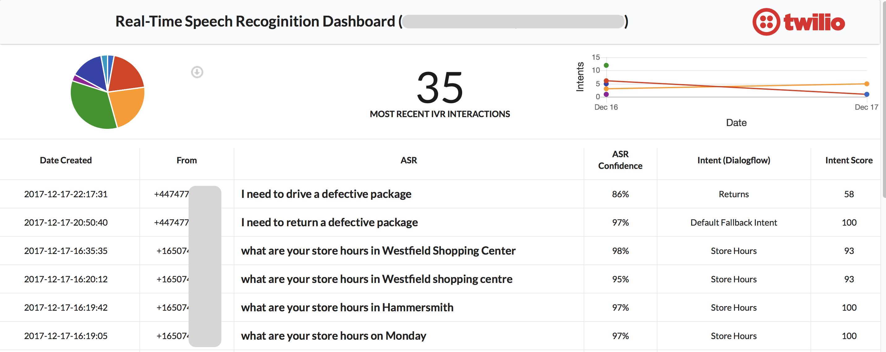

# Twilio ASR and Intent Realtime Dashboard

This demo is about the power of using Twilio realtime Automated Speech Recoginition (ASR) and Intent analysis system (Dialogflow) in an IVR. Because Twilio makes it so easy to collect customer speech and related intent, one of the business benefits is direct access to what your customers are calling for and saying so the calls can be router accurately.  

Let's say your organisation want to implement a Speech or Chat bot in your customer journey.  The first question that arises is how should the bot be designed, what intents will it recognise so the calls are routed correctly with the right context to the customer care agent.  There are two options to go about - one is to use your own judgement/guess work to design the intents the bot will recognise.  Or, you can directly listen to your customers and create the best experience.  That's exactly what some of our most brand concious customers have done.  They integrated this code into their production contact centre.  Once they collected thousands of customer speech phrases, they've started refining their bot for most accurate intent based routing.

Lets get started...

## Realtime ASR and Intent Dashboard

You'll need following accounts:
1) Twilio (https://www.twilio.com)
2) Dialogflow (https://dialogflow.com)
3) Heroku (if you want a one-click install) (https://www.heroku.com)

## Technologies
1) Twilio Speech Recoginition (https://www.twilio.com/speech-recognition)
2) Twilio Sync (https://www.twilio.com/sync)
3) Server side app using Python and Twilio REST APIs (Sync)
4) Dialogflow REST API 
5) Dashboard app components:
5.1) Javascript framework Vue.js (https://vuejs.org)
5.2) UI framework Semantic-ui (https://semantic-ui.com)
5.3) Twilio Sync JS SDK (https://www.twilio.com/docs/api/sync/quickstart-js)

## Setup

### Configuring Dialogflow
1) Upload the ASRIntents.zip file into the Dialogflow console (https://dialogflow.com/docs/intents#upload_intents)
2) Obtain the developer access key from the dialogflow console (https://dialogflow.com/docs/reference/agent/#obtaining_access_tokens)
3) You'll need this key when you configure during Heroku app install

### Obtaining Credentials and Sync Service ID
1) Log into your Twilio console to get:
1.1) Account SID and Auth Token from console dashboard
1.2) API Key and Secret (https://www.twilio.com/console/runtime/api-keys)
1.3) Create a Sync Service (https://www.twilio.com/console/sync/services)
2) You'll need the Twilio Credentials and Sync Service ID during the Heroku app install

### Create a Sync Map (ASRBotEvents)
Sync Map object is used to store call details along with ASR and Intents. This map is subscribed by the frontend dashboard.
Run the following CURL command:
curl -X POST https://sync.twilio.com/v1/Services/<SYNC_SERVICE_ID>/Maps \
 -d 'UniqueName=ASRBotEvents' \
 -u 'YOUR_TWILIO_ACCOUNT_SID:YOUR_TWILIO_AUTH_TOKEN'

### One Click Heroku Deploy of Web App
This will install the wep application and all the dependencies on Heroku (login required). As part of the installation, the Heroku app will walk you through configuration of environment variables.  Please click on the following button to deploy the application.

### Configuring Twilio inbound phone number
1) Log into your Twilio console and purchase a phone number
2) Assign the URL https://<YOUR_HEROKU_APP_URL>/start?language=en-GB to the phone number

### You're all set
Now, Navigate to https://<YOUR_HEROKU_APP_URL>

As the phone calls come into your Twilio phone number, the user ASR and Intent will be displayed in the dashboard. 

I look forward to your feedback.
Ameer
https://www.linkedin.com/in/ameer/